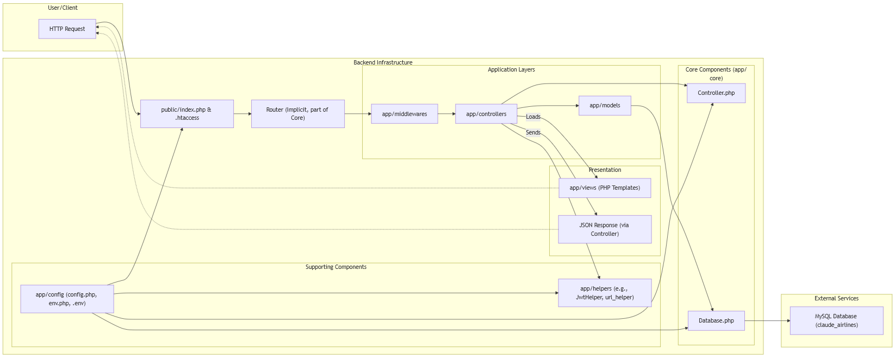
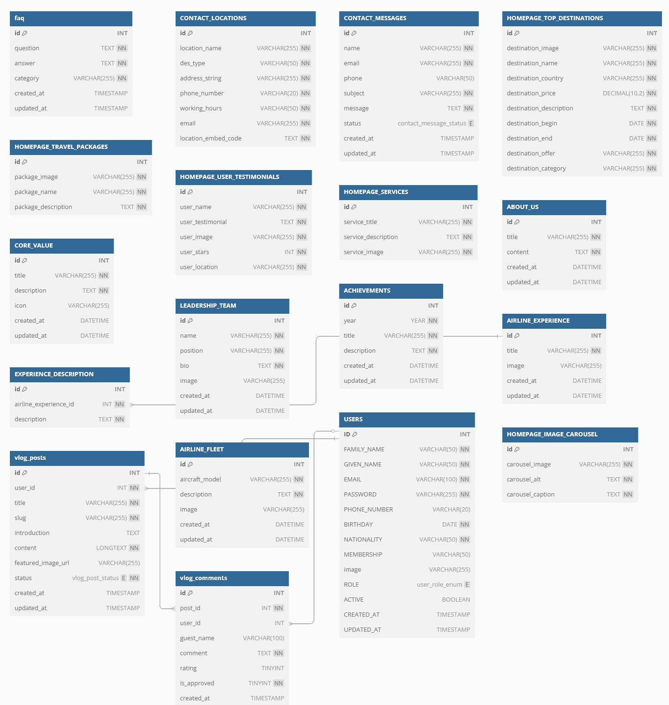

<p align="center">
  
</p>

<h1 align="center">Claude Airlines – Flight Booking System</h1>

<p align="center">
  <a href="https://claude-airplanes.web.app" target="_blank">
    
  </a>
  <a href="https://reactjs.org/" target="_blank">
    
  </a>
  <a href="https://www.php.net/" target="_blank">
    
  </a>
  <a href="https://www.mysql.com/" target="_blank">
    
  </a>
</p>

<p align="center">
  Welcome to Claude Airlines, a comprehensive flight booking and management system designed to provide a seamless, modern, and user-friendly experience.
  <br />
  <em>"Fly with the future!"</em>
  <br />
  <strong>Live Deploy: <a href="https://claude-airplanes.web.app" target="_blank">https://claude-airplanes.web.app</a></strong>
</p>

---

## 📋 Table of Contents

- [✨ Overview](#-overview)
- [🌟 Key Features](#-key-features)
- [📸 Screenshots](#-screenshots)
- [🏗️ Architecture](#️-architecture)
- [🛠️ Technologies Used](#️-technologies-used)
- [🔒 Security Highlights](#-security-highlights)
- [🏁 Getting Started](#-getting-started)
- [📁 Project Structure](#-project-structure)
- [🌐 SEO & Best Practices](#-seo--best-practices)

---

## ✨ Overview

Claude Airlines is a hypothetical airline project developed with the goal of delivering high-quality, modern, and user-centric air travel services. In an increasingly competitive aviation industry that demands rapid technological adaptation, Claude Airline aims to be a pioneer in service digitalization and customer experience enhancement.

The platform allows users to effortlessly search for flights, compare prices, book tickets, and manage their profiles. Administrators have access to a dedicated panel for managing flight data, bookings, user accounts, and website content.

**Core Objectives:**
*   Provide quick and convenient online flight booking.
*   Offer comprehensive and transparent official airline information.
*   Support user account management and customer care.
*   Design for future scalability (e.g., loyalty programs, automated support).

---

## 🌟 Key Features

### User-Facing:
*   **Intuitive Flight Search & Booking:** Easily find, compare, and book flights.
*   **Modern & Responsive UI:** Seamless experience across desktop, tablet, and mobile devices.
*   **User Authentication & Profile Management:** Secure registration, login, and profile updates (personal info, avatar).
*   **Booking Management:** View booking history and details.
*   **Newsletter Subscription:** Stay updated with news and promotions.
*   **Rich Content Pages:**
    *   **Homepage:** Hero slider, quick search, featured destinations, travel packages, testimonials.
    *   **About Us:** Company history, core values, leadership team, achievements, airline experience.
    *   **Contact Us:** Contact form, location details, embedded Google Maps.
    *   **FAQ:** Categorized and searchable frequently asked questions.
    *   **Airline Fleet:** Information about aircraft.

### Admin Panel:
*   **Comprehensive Dashboard:** Centralized management of airline operations.
*   **User Management:** View, activate/deactivate user accounts, reset passwords.
*   **Content Management System (CMS):**
    *   Manage static page content (Homepage, About Us, Contact, FAQ).
    *   Update airline details: destinations, travel packages, testimonials, services, core values, leadership team, fleet information, achievements.
*   **Booking Oversight:** (Assumed - typically admin panels manage bookings)
*   **Customer Inquiry Management:** View and respond to user messages.

---

## 📸 Screenshots

### Application Interface
|  |  |  |
|:---:|:---:|:---:|
|  |  |  |
|  |  |  |
|  |  |  |

### Architecture Design


*Backend Component Diagram*


*Database Entity Relationship Diagram UML*

---

## 🏗️ Architecture

The project follows the **Model-View-Controller (MVC)** architectural pattern to ensure a clear separation of concerns, maintainability, and scalability. It employs a hybrid approach for the view layer:

*   **Model (M):** Handles data logic and interaction with the MySQL database. All database operations (CRUD) are encapsulated within PHP classes.
*   **View (V):**
    *   **Client-Side (SPA - Single Page Application):** Built with **React.js**. It provides a dynamic and responsive user interface, fetching and sending data to the backend via RESTful APIs (JSON).
    *   **Admin Panel (SSR - Server-Side Rendering):** Uses **PHP** for server-side rendering, leveraging the Mazer Admin Bootstrap template for a consistent and functional interface.
*   **Controller (C):** Acts as an intermediary between the Model and the View. It processes user requests, interacts with the Model to fetch or manipulate data, and then selects the appropriate View to present the data to the user.

This hybrid approach leverages the strengths of SPA for a rich, interactive user experience and traditional SSR for a straightforward and efficient admin interface, all while sharing common backend business logic through the Controllers and Models.

---

## 🛠️ Technologies Used

### Frontend
*   **React.js (v18+):** Core JavaScript library for building user interfaces.
*   **React Router DOM:** For client-side routing and navigation.
*   **Axios & Fetch API:** For making HTTP requests to the backend.
*   **Tailwind CSS:** A utility-first CSS framework for rapid UI development.
*   **React Helmet:** For managing document head changes (SEO).
*   **React Icons:** For a wide variety of SVG icons.
*   **Slick Carousel (via React Slick):** For image carousels and sliders.
*   **Anime.js:** For animations.
*   **Web Vitals:** For measuring user experience metrics.
*   **Firebase Hosting:** For deployment of the frontend application.

### Backend
*   **PHP (v8.x thuần/vanilla):** Server-side scripting language.
*   **MySQL (v5.7+):** Relational database management system.
*   **RESTful APIs:** Custom-built APIs for communication between frontend and backend, returning JSON.
*   **MVC Architecture:** Custom implementation.

### Admin Panel
*   **Mazer Admin Template:** (HTML, CSS, Bootstrap 5)
*   **PHP:** For server-side rendering and business logic.

### Development & Deployment Tools
*   **XAMPP:** Local development environment (Apache, MySQL, PHP).
*   **Git & GitHub:** Version control and repository hosting.
*   **npm / Node.js:** For frontend dependency management and build processes.
*   **phpMyAdmin:** For database administration.

---

## 🔒 Security Highlights

Security is a key consideration in Claude Airlines. The following measures have been implemented:
*   **Input Validation:** Rigorous validation of all user inputs on both client and server sides.
*   **Output Encoding:** To prevent Cross-Site Scripting (XSS) vulnerabilities.
*   **Prepared Statements:** Using PDO/MySQLi with prepared statements to mitigate SQL Injection (SQLi) risks.
*   **Password Hashing:** Securely hashing user passwords using `password_hash()`.
*   **File Upload Security:** Validating file types and sizes, and storing uploads securely.
*   **Directory Traversal Prevention:** Ensuring file paths are sanitized.
*   Consideration for **CSRF (Cross-Site Request Forgery)** protection (e.g., using tokens).

---

## 🏁 Getting Started

To get a local copy up and running, follow these simple steps.

### Prerequisites
*   Node.js (v16.x or higher) and npm (v8.x or higher)
*   XAMPP (or any similar stack with PHP 8.x, MySQL 5.7+, Apache)
*   Git

### 1. Clone the Repository
```bash
git clone https://github.com/bawfng04/ClaudeAirlines.git
cd ClaudeAirlines
```

### 2. Setup the Frontend
```bash
cd frontend
npm install
npm start
```
The frontend will be accessible at http://localhost:3000.

### 3. Setup the Backend
- **Start XAMPP:**
  - Ensure Apache and MySQL services are running.
- **Create Database:**
  - Navigate to `http://localhost/phpmyadmin`.
  - Create a new database (e.g., `claude_airlines` or as specified in your `.env` later).
  - Import the database schema and initial data:
    - Go to the "Import" tab.
    - Import `backend/sql/table.sql` to create tables.
    - Import `backend/sql/insert.sql` to populate initial data.
- **Configure Environment:**
  - In the `backend/app/` directory, copy `.env.example` to `.env`.
  - Open `.env` and fill in your database credentials (`DB_HOST`, `DB_USER`, `DB_PASS`, `DB_NAME`), `JWT_SECRET`, and `BASE_URL`.
    - *Example `BASE_URL`*: If XAMPP's `htdocs` points to `ClaudeAirlines/` and your backend is accessed via `http://localhost/backend/public`, then `BASE_URL` might be `/backend/public/`. If XAMPP's document root is set directly to `ClaudeAirlines/backend/public/`, then `BASE_URL` might be `/`.
- **Configure XAMPP Document Root (Optional but Recommended):**
  - For cleaner URLs, configure an Apache Virtual Host or set XAMPP's main document root to point to the `ClaudeAirlines/backend/public/` directory. This allows accessing the API directly via `http://localhost/`.
  - Alternatively, access via `http://localhost/path/to/ClaudeAirlines/backend/public/`.
- **Frontend API Configuration:**
  - In the `frontend/` directory, copy `.env.example` to `.env`.
  - Update `REACT_APP_BASE_URL` to point to your backend API (e.g., `http://localhost/backend/public` or `http://localhost/api` if you used virtual hosts).

### 4. Access the Application
Frontend: http://localhost:3000
Backend API Base: (e.g., http://localhost/backend/public/ or as configured)

---

## 📁 Project Structure

```
ClaudeAirlines/
├── frontend/                # React.js frontend application
│   ├── public/             # Public assets (index.html, favicon, sitemap.xml, robots.txt)
│   ├── src/
│   │   ├── api/            # API call definitions
│   │   ├── assets/         # Static assets (images, logos, etc.)
│   │   ├── components/     # Reusable UI components (Header, Footer, Buttons)
│   │   ├── helpers/        # Utility functions (formatting, validation)
│   │   ├── pages/          # Page components (Home, About, Login, etc.)
│   │   ├── App.js          # Main application component
│   │   └── index.js        # Entry point
│   ├── .env                # Environment variables for frontend
│   └── package.json
│
├── backend/                 # PHP backend application
│   ├── app/
│   │   ├── controllers/    # MVC Controllers (handle requests, interact with models)
│   │   ├── core/           # Core classes (Database connection, base Controller/Model)
│   │   ├── helpers/        # Helper functions for backend
│   │   ├── middlewares/    # Request processing middleware (e.g., auth)
│   │   ├── models/         # Database models (data interaction logic)
│   │   └── views/          # PHP templates for Admin SSR (if not fully API driven)
│   ├── config/             # Configuration files (e.g., database.php)
│   ├── public/             # Public entry point (index.php, assets for admin panel)
│   │   ├── assets/         # CSS, JS, images for Admin panel
│   │   └── index.php       # Front controller
│   ├── sql/                # SQL scripts for database setup
│   └── .env                # Environment variables for backend
│
└── images/                  # Project-level images (screenshots, diagrams, logo)
└── README.md
```

---

## 🌐 SEO & Best Practices
- **Dynamic Meta Tags:** Uses React Helmet for dynamic `<title>` and `<meta>` tags per page, crucial for SEO in SPAs.
- **Sitemap & Robots.txt:** Includes `sitemap.xml` and `robots.txt` in the `frontend/public/` directory to guide search engine crawlers.
- **Semantic HTML:** Structured with semantic HTML5 elements for better accessibility and SEO.
- **Image Alt Attributes:** All significant images use descriptive `alt` attributes.
- **Responsive Design:** Ensures usability across various screen sizes.



*Database Entity Relationship Diagram*